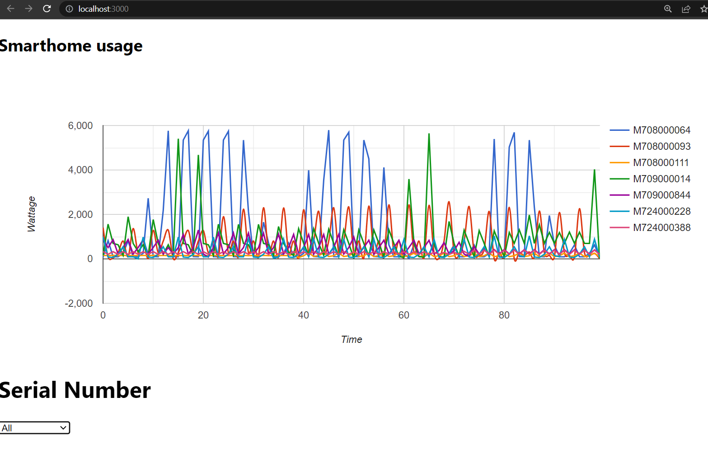

# Smart Homes Data Visualization

## Dependencies:
```
- An existing version of Node on your system (v16.13.0)
- An existing installation of npm on your system (v8.9.0)
```
## Using App via deployed Pages: The frontend pages are deployed here
https://apluualberta.github.io/Vivid-Theory-Coding-Challenge/
### Step 1: Deploy backend
- Consult Deployment - Step 2

### Step 2: Use the app!
- Consult Deployment - Step 4

## Deployment:
### Step 1: Clone the repository and go into the directory
```
$ git clone https://github.com/ApluUalberta/Vivid-Theory-Coding-Challenge 
$ cd Vivid-Theory-Coding-Challenge

# (private repository, only relevant users were given access)
```
### Step 2: Initialize the backend
#### Open up a terminal and run the following commands
```
# Assuming you are in /Vivid-Theory-Coding-Challenge
$ cd backend
$ npm i
$ npm start
```
#### The backend should have the following url: http://127.0.0.1:4000/graphql

### Step 3: Initialize the Frontend
#### Open up another terminal and run the following commands
```
# Assuming you are in /Vivid-Theory-Coding-Challenge
$ cd frontend
$ npm i
$ cd my-app
$ npm i
$ npm start
```
#### The frontend should have the following url: http://localhost:3000/

### Step 4: Usage
1. Upon first entering the site, you should see this:

2. Using Serial number, you can access the drop down menu for any specific smart home serial number:
   


3. Let's try M708000111. We now see all aggregate readings (regardless of device ID for the given serial num, as shown by the combination of dropdown menus):


4. Let's try selecting a specific Device ID (9e40878db). This is a query for a specific device ID and specific serial number. The bottom left dropdown and the legend shows the specific device id


5. Circling back, lets select ALL serial numbers to get aggregate readings:


### Production Deployment instructions
* Deployment methods were done using Azure, though I ran into issues with opening up the instance ports
1. Create a virtual linux machine instance as done here:
https://www.youtube.com/watch?v=3Ecm90UZHv0
2. Install the application
Node Installation with dependencies
```
$ curl -sL https://deb.nodesource.com/setup_14.x | sudo -E bash -
$ sudo apt-get install -y nodejs
$ sudo apt-get install -y build-essential
```
Now, you should have Node and npm. We can then clone
```
$ git clone https://github.com/ApluUalberta/Vivid-Theory-Coding-Challenge
```
Now, follow Deployment - Steps 2 and 3. You may need to keep using npm i on the missing dependencies.
After the dependencies are installed, run the backend with `npm start` within the `./Vivid-Theory-Coding-Challenge/backend` folder. 

Now, we need to initialize the proper react port and host addresses
```
$ export PORT=80
$ export HOSTNAME=<INSTANCE_IP>
$ npm start
```

3. After the instance is created, Navigate to the networks tab under the instance window:

4. These are the security settings used:

5. Access the application in your browser at (https://<AZURE_IP>:80)


## Things to note for optimization and improvement
- The application queries the database for readings every time, these could easily be stored into a cache
- There was an unused query called average_wattage that was meant to get the average aggregate wattage consumption for every smart home. This was meant to be used for a piechart
  - This was dropped due to not knowing how to query for generated AVG() columns through sql using graphql's querying system. (Likely incompetence)
- The aggregation of all smarthomes was dohne using a hardcoded 100 value (since this was programmed into the sql queries).
- Styling could use some improvement.
- Some packages, such as apollo client are unused and can be trimmed
- Deployment issues have been run into, probably get that done soon!

# Assignment specifications as stated by Vivid Theory:
###

## Introduction

The purpose of this assignment is to evaluate your full stack application development skills. Principles and best practices of front end design, responsive components, DRY, client server model, git-flow, user experience, and page performance will all be tested.

In a project such as this we want you to focus on the things that matter. Code structure, architecture, design patterns, and overall approach is more important than having a great custom webpack configuration. Focus on the main platform features.

Please spend time creating a simple and elegant solution rather than fighting with a framework or library!

## Timeline

The suggested time to complete this challenge is ~8 hours. Upon receiving the challenge you will have three days to make a final submission.

## Problem Definition

Vivid Theory is in need of a simple dashboard for visualizing electrical consumption for a group of homes.

## Data

We have a dataset that includes information collected from multiple smart home electricity monitoring devices. Data is sampled at one minute intervals and contains the following factors:

| Factor           | Units  |                   Explanation |
| ---------------- | :----: | ----------------------------: |
| Serial_Number    | string |                 Unique device |
| DateTime         |  date  |             Date of recording |
| Device_ID        | string |           Instrumented device |
| Device_Name      | string |     User assigned device name |
| User_Device_Name | string |          Detected device type |
| Device_Type      | string | User assigned device category |
| Device_Make      | string |             Manufacturer name |
| Device_Model     | string |       Manufacturer model name |
| Device_Location  | string |          Location within home |
| Wattage          | number |       Sampled wattage reading |

**note**
This is a real dataset. It may contain missing or invalid entries.

### Factor Explanation

- Device_ID
  - main: Main electrical panel within home
  - always_on: Wattage attributed to consistent electrical consumption within the home

Factors of importance are Serial_Number, Device_ID, and wattage. Serial_Number represents a unique device placed within a household. Wattage is monitored at the Device_ID level within the home.

Data can be accessed in the `readings` table at:

`host=smarthomes.postgres.database.azure.com port=5432 dbname=wattage user=smarthomesdashboarduser@smarthomes password=b5zT;q_fS\aAUtpD sslmode=require`

## Business Requirements

Implement a responsive line chart that depicts electrical consumption within the home. Your UI should have the following components

- Line chart

  - Horizontal axis shows the time
  - Vertical axis shows wattage

- Combo box or drop down for Serial_Number

  - The user should be able to either view all data aggregated or filter by specific Serial_Number

- Combo box or drop down for Device_ID
  - As a secondary filter the user should be able to view data or filter to a specific Device_ID
  - Ensure that this filter works appropriately with the Serial_Number filter

## Technical Requirements

Construct a client server application that fulfils the business requirements. Both the client and server should be written in typescript.

### Stack

- Front End
  - [React](https://reactjs.org/)
    - [Create React App](https://github.com/facebook/create-react-app)
  - [Material UI](https://material-ui.com/)
- Back End
  - Framework
    - [Nest.js](https://nestjs.com/)
    - [GraphQL](https://graphql.org/)
  - ORM
    - [sequelize](https://sequelize.org/)
    - or [TypeORM](https://typeorm.io/#/)
    - or no ORM
- Database
  - [PostgreSQL](https://www.postgresql.org/) Provided

#### Acceptable alternatives

- REST over GraphQL
- Express (or any other TS backend framework) over Nest.js
- Any charting library or framework

## Important Considerations

- Performance
  - You are not allowed to load all database rows into the browser at once. Your program should query and load data as needed.
- Patterns
  - Employ reusable/dry principles. Use OOP/Functional patterns as necessary.
- Deployment
  - Provide clear instructions on how to start your project in both a development and production setting

Feel free to make any reasonable assumptions about this assignment, innovate and add your personal
touches as you see fit. Please reach out if you have any questions!
